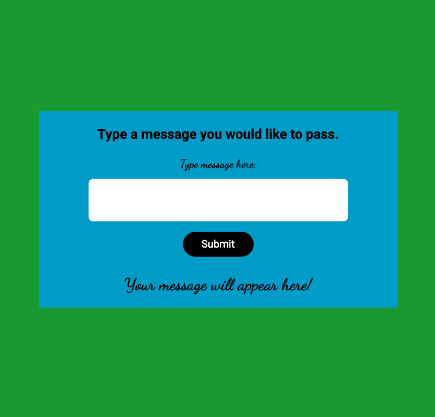
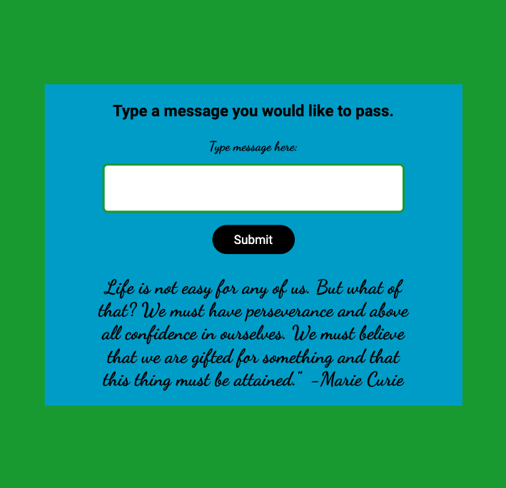

# Pass the Message with JavaScript

## Table of Contents

- [Pass the Message with JavaScript](#pass-the-message-with-javascript)
  - [Table of Contents](#table-of-contents)
  - [General Information](#general-information)
  - [Screenshots](#screenshots)
  - [Technologies](#technologies)
  - [Site Link](#site-link)
  - [What I Learned](#what-i-learned)
  - [Continued Learning](#continued-learning)
  - [Author](#author)

---

## General Information

This is Project #3 from [100+ JavaScript Projects for Beginners!](https://jsbeginners.com/pass-the-message-project/)
In this challenge you must select the input element's value from the DOM, when you click the “Submit” button your message inputted in the form will be visible in the “Last Message Delivered” Section. In addition to the challenge, I added a reset to clear the form after clicking submit and the message input section features a submit button by pressing down on the "Enter" key.

## Screenshots





## Technologies

- HTML
- CSS
- JavaScript

## Site Link

>**Live Site: [Pass the Message](https://vlorozco.github.io/javascript-pass-the-message/)**

## What I Learned

While completing this project, I realized that my message would not submit when I pressed enter. This project led me to search and use the `keypress` JS HTML DOM Event to check if the KeyboardEvent `.key` property is equal to `"Enter"`.

```js
// Execute a function when the user presses the "Enter" key on the keyboard
message.addEventListener('keypress', function(event){
   // If the user presses the "Enter" key on the keyboard
  if (event.key === "Enter"){
    // Cancel the default action, if needed
    event.preventDefault();
    // Trigger the submit button element with a click
    submit.click();
  }
});
```

## Continued Learning

I look forward to creating more JavaScript projects and building my skills. Happy coding everyone!

## Author

- Github - [Veronica L. Orozco](https://github.com/VLOrozco)
- Frontend Mentor - [@VLOrozco](https://www.frontendmentor.io/profile/VLOrozco)
- Codecademy - [orozcov3](https://www.codecademy.com/profiles/orozcoV3)
